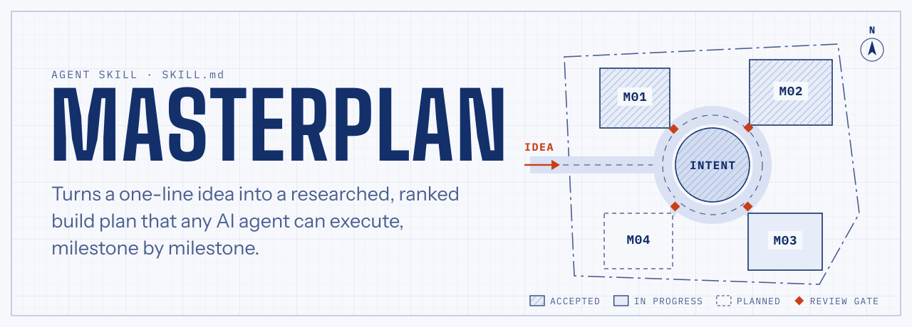
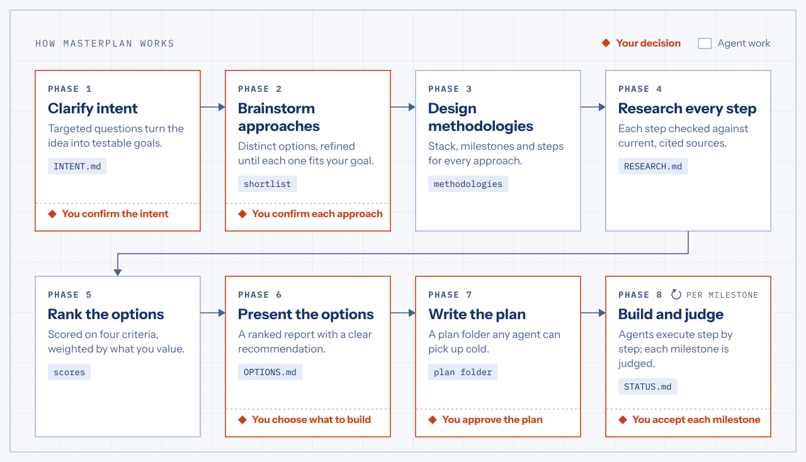
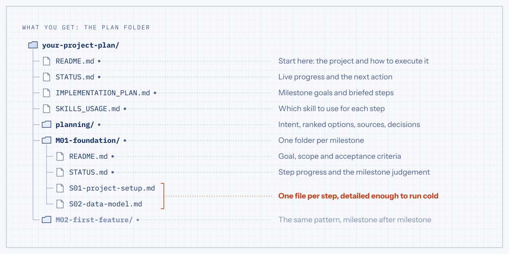
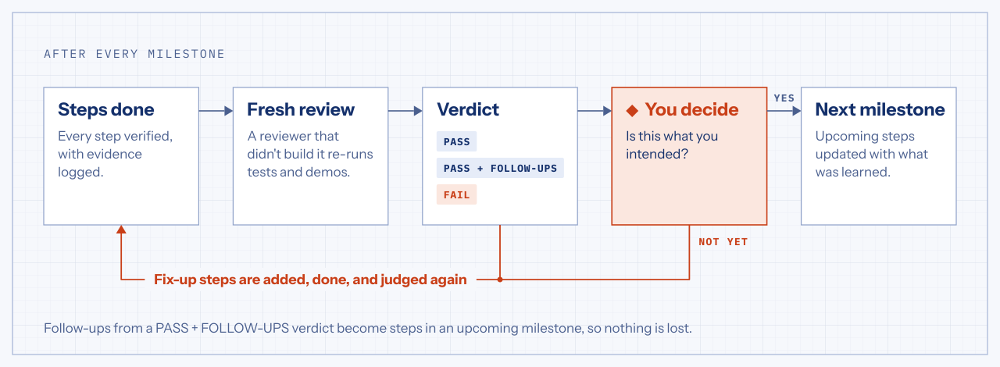

<picture>
  <source media="(prefers-color-scheme: dark)" srcset="assets/hero-dark.svg">
  <source media="(prefers-color-scheme: light)" srcset="assets/hero-light.svg">
  
</picture>

<p align="center">
  <a href="https://skills.sh/ezzuldinSt/masterplan/masterplan"></a>
  <a href="https://agentskills.io/specification"></a>
  <a href="LICENSE"></a>
</p>

**Masterplan** is an agent skill that plans a software project before any code is written. You describe an idea in a sentence. Masterplan asks the questions that would change the plan, proposes genuinely different approaches, checks every step against current best practice and ranks the options for you. Once you choose, it writes a plan folder that another agent can pick up cold and build milestone by milestone, with you signing off on each one.

## Install

**Any agent, with the [skills CLI](https://skills.sh)** (Claude Code, Codex, Cursor, GitHub Copilot, Gemini CLI and more):

```bash
npx skills add ezzuldinSt/masterplan
```

The CLI detects the coding agents you have installed. To install the skill for Claude Code only, across all your projects:

```bash
npx skills add ezzuldinSt/masterplan -g -a claude-code
```

**Claude Code, by hand:**

```bash
git clone https://github.com/ezzuldinSt/masterplan.git
cp -r masterplan/skills/masterplan ~/.claude/skills/
```

**Claude on the web or desktop:** download [`masterplan.zip`](https://github.com/ezzuldinSt/masterplan/releases/latest/download/masterplan.zip), open **Customize → Skills**, click **+**, then **Create skill → Upload a skill**, and choose the zip. Skills need code execution, which you can turn on under **Settings → Capabilities**.

## Use it

In Claude Code, start a message with the skill's name:

```text
/masterplan a booking app for a small physiotherapy clinic, with reminders and a waitlist
```

Agents also pick it up on their own when you describe something you want to build: "I have an idea for…", "how should I build…", "plan this feature" or "write an implementation plan another agent can follow". To continue an earlier plan, point it at the plan folder it wrote; it reads the status and carries on from there. You can also ask it to judge a finished milestone.

## How it works

<picture>
  <source media="(prefers-color-scheme: dark)" srcset="assets/workflow-dark.svg">
  <source media="(prefers-color-scheme: light)" srcset="assets/workflow-light.svg">
  
</picture>

Masterplan does the legwork and leaves the decisions to you. Nothing moves past these five points without your answer:

1. **The intent is right.** Your idea becomes testable success criteria in `INTENT.md`, the yardstick for everything that follows.
2. **Each approach fully satisfies your goal.** The shortlist keeps being refined until you say yes to every option on it.
3. **Which option to build.** You pick one from the ranked report, or combine parts of several.
4. **The plan is approved.** You review the milestones before anything is built.
5. **Each milestone is what you intended.** You accept the result before the next milestone starts.

In an unattended run, where nobody can answer, it takes the recommended default, records it as an assumption and raises it at the next review.

## How the options are ranked

Each implementation option is scored from 1 to 10 on four criteria with fixed definitions, so the scores can be compared. You set the weights; they start out equal.

| Criterion | What it measures |
|---|---|
| **Professionalism** | Alignment with current industry standards: security, maintainability, testing, documentation |
| **Efficiency** | Effort, time to first value, and the cost to build and run, relative to what is delivered |
| **Performance** | Speed, scalability and reliability at the load you described |
| **Quality of outcome** | How completely and how well the result meets your success criteria |

Every score comes with a justification that points to evidence: a cited source, a success criterion or an estimate. Before recommending its top pick, Masterplan argues against it.

## What you get

<picture>
  <source media="(prefers-color-scheme: dark)" srcset="assets/plan-folder-dark.svg">
  <source media="(prefers-color-scheme: light)" srcset="assets/plan-folder-light.svg">
  
</picture>

The plan is written for an agent that has never seen your conversation. Each step file holds the exact paths, commands, interfaces and configuration it needs, its acceptance criteria and a way to verify them, and the pitfalls the research turned up, with sources. `STATUS.md` always names the next action, so any agent or person can continue where the last one stopped. `SKILLS_USAGE.md` maps every step to skills that are actually installed, with a fallback for each.

## Every milestone is judged

<picture>
  <source media="(prefers-color-scheme: dark)" srcset="assets/judgement-dark.svg">
  <source media="(prefers-color-scheme: light)" srcset="assets/judgement-light.svg">
  
</picture>

Ticked-off steps don't prove that a milestone works. After its last step, a reviewer that didn't do the work (a fresh sub-agent, where the agent supports them) re-runs the tests, demos the result and checks each acceptance criterion against your intent. Then you decide. A milestone that falls short gets fix-up steps and is judged again before the next one starts.

## Good to know

- **It scales to the idea.** A weekend script gets fewer approaches, lighter research and fewer milestones. The decision points stay the same.
- **It works without web access.** Steps it couldn't check against current sources are marked `UNVERIFIED`, and checking them becomes the first task of their milestone.
- **It uses what your agent offers:** a structured question tool when there is one, sub-agents for parallel research and fresh reviews, and web search for current best practices.
- **The plan is plain markdown.** Commit the folder to your repository, review it in a pull request or hand it to a different agent.

## Repository layout

```text
skills/masterplan/SKILL.md   the skill
assets/                      illustrations for this README
```

## License

[MIT](LICENSE)
